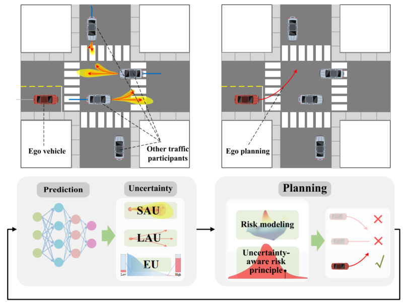
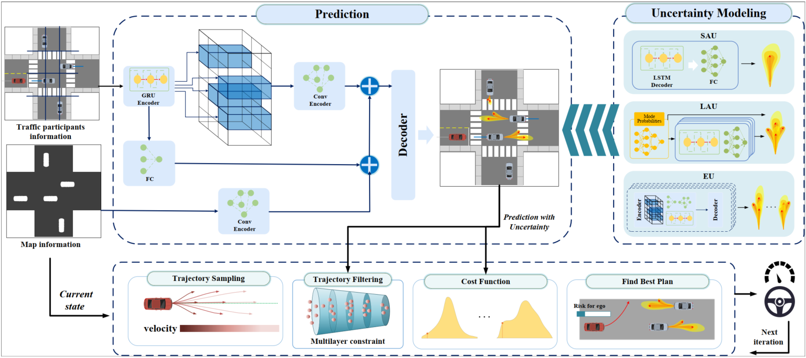
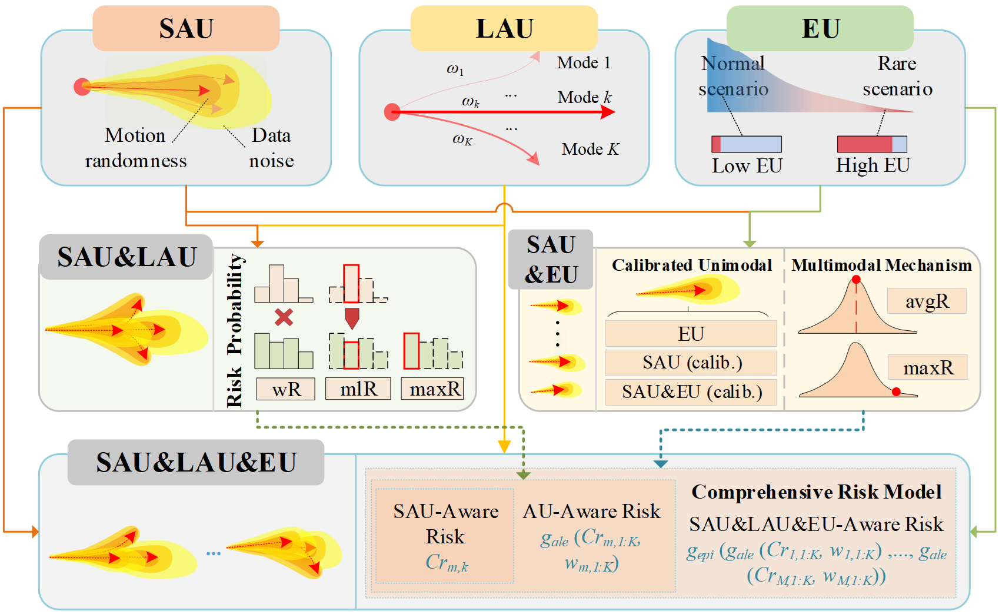
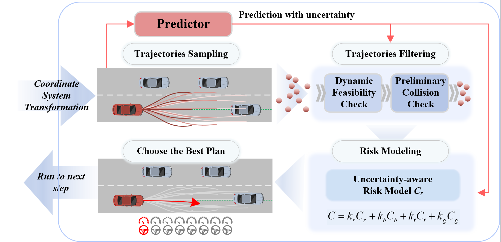
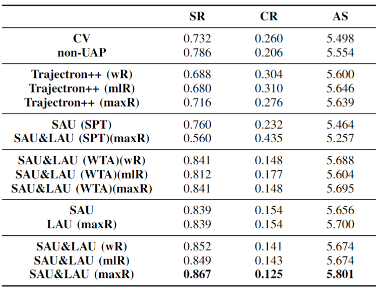
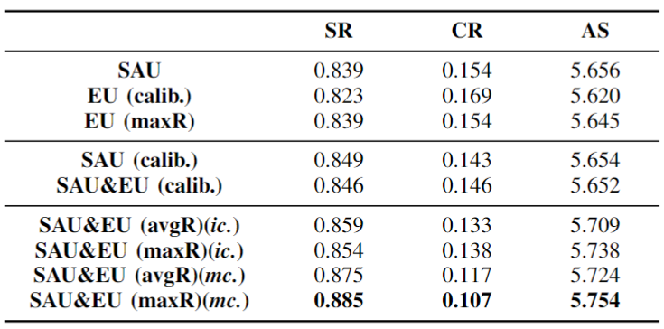
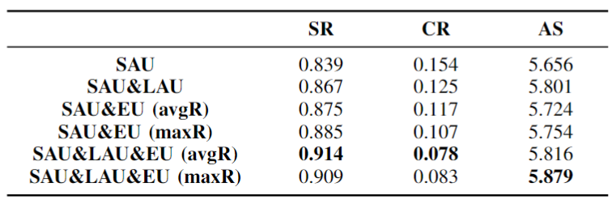
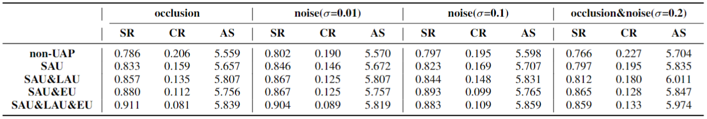
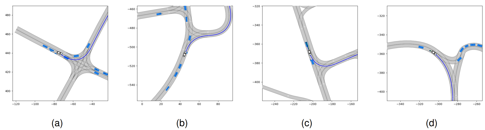
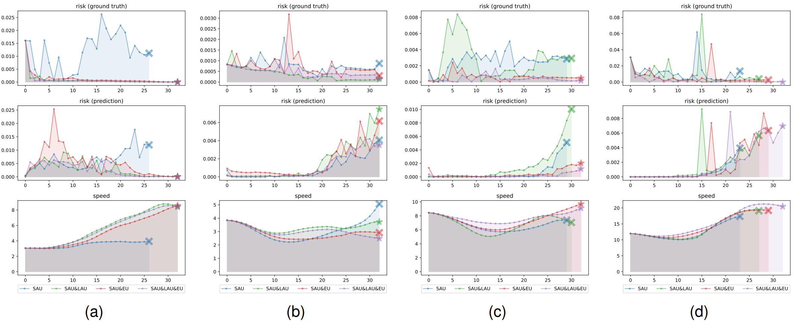

[//]: # (# PMBP)

[//]: # ([Wenbo Shao]&#40;https://scholar.google.com/citations?user=nJgFCn0AAAAJ&hl=zh-CN&oi=ao&#41;)
[//]: # (Wenbo Shao, Boqi Li, Wenhao Yu, Jiahui Xu, Hong Wang)

[//]: # ()
[//]: # (- School of Vehicle and Mobility, Tsinghua University )

[//]: # (- Department of Civil and Environmental Engineering, University of Michigan )

[//]: # (- School of Mechanical Engineering, Beijing Institute of Technology)

<p align="center">

</p>

# 1. Abstract
Autonomous driving systems face the formidable challenge of navigating intricate and dynamic environments with uncertainty. This study presents a unified prediction and planning framework that concurrently models short-term aleatoric uncertainty (SAU), long-term aleatoric uncertainty (LAU), and epistemic uncertainty (EU) to predict and establish a robust foundation for planning in dynamic contexts. 
SAU captures inherent randomness in the behavior of traffic participants, while LAU accounts for their diverse behavioral patterns. EU encompasses uncertainties arising from inadequate model cognition.
The framework uses Gaussian mixture models and deep ensemble methods, to concurrently capture and assess SAU, LAU, and EU, where traditional methods do not integrate these uncertainties simultaneously.
Additionally, uncertainty-aware planning is introduced, considering various uncertainties. The study's contributions include comparisons of uncertainty estimations, risk modeling, and planning methods in comparison to existing approaches.
The proposed methods were rigorously evaluated using the CommonRoad benchmark and settings with limited perception. These experiments illuminated the advantages and roles of different uncertainty factors in autonomous driving processes.
In addition, comparative assessments of various uncertainty modeling strategies underscore the benefits of modeling multiple types of uncertainties, thus enhancing planning accuracy and reliability. The proposed framework facilitates the development of methods for UAP and surpasses existing uncertainty-aware risk models, particularly when considering diverse traffic scenarios.

# 2. Method Overview

Proposed unified prediction and planning framework that considers different types of uncertainties.



[//]: # (The modeled uncertainties and their combinations, as well as various)

[//]: # (uncertainty-aware risk models.)

[//]: # ()
[//]: # (<p align="center">)

[//]: # ()

[//]: # (</p>)

[//]: # ()
[//]: # ()
[//]: # (The process of uncertainty-aware planning.)

[//]: # ()
[//]: # (<p align="center">)

[//]: # ()

[//]: # (</p>)


# 3. Experimental Results

[//]: # (## 3.1. Planning under Aleatoric Uncertainty)

[//]: # (<p align="center">)

[//]: # ()

[//]: # (</p>)

[//]: # ()
[//]: # ()
[//]: # (## 3.2. Planning with Consideration of Epistemic Uncertainty)

[//]: # (<p align="center">)

[//]: # ()

[//]: # (</p>)

[//]: # ()
[//]: # (## 3.3. Analysis of Comprehensive Risk Model)

[//]: # (<p align="center">)

[//]: # ()

[//]: # (</p>)

[//]: # ()
[//]: # ()
[//]: # (## 3.4. Testing under Limited Perception)

[//]: # (<p align="center">)

[//]: # ()

[//]: # (</p>)

[//]: # ()
[//]: # ()
[//]: # (## 3.5. Analysis of Typical Cases)

[//]: # ()
[//]: # (<p align="center">)

[//]: # ()

[//]: # ()

[//]: # (</p>)


[//]: # (## 3.6. Citation)

[//]: # ()
[//]: # (```)

[//]: # ()
[//]: # (@article{shao2023likely,)

[//]: # ()
[//]: # (  title={When Is It Likely to Fail? Performance Monitor for Black-Box Trajectory Prediction Model},)

[//]: # ()
[//]: # (  author={Shao, Wenbo and Li, Boqi and Yu, Wenhao and Xu, Jiahui and Wang, Hong},)

[//]: # ()
[//]: # (  journal={IEEE Transactions on Automation Science and Engineering},)

[//]: # ()
[//]: # (  year={2023},)

[//]: # ()
[//]: # (  publisher={IEEE})

[//]: # ()
[//]: # (})

[//]: # ()
[//]: # (```)

# Visaualization
## SAU
| <video muted controls width=380> <source src="./src/PR/DEU_Lohmar-58_1_T-1.mp4"  type="video/mp4"> </video> | <video muted controls width=380> <source src="./src/PR/USA_Lanker-2_22_T-1.mp4"  type="video/mp4"> </video> |

| <video muted controls width=380> <source src="./src/PR/USA_US101-26_1_T-1.mp4"  type="video/mp4"> </video> | <video muted controls width=380> <source src="./src/PR/ZAM_Tjunction-1_442_T-1.mp4"  type="video/mp4"> </video> |


# 4. Contact
If you have any questions, feel free to contact Wenbo Shao ([swb19@mails.tsinghua.edu.cn](swb19@mails.tsinghua.edu.cn)).